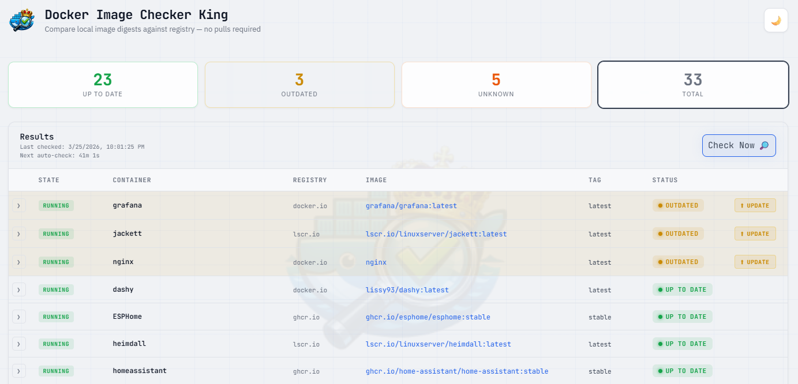
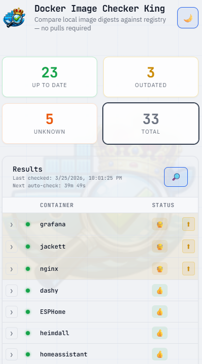

# Docker Image Checker King 🐳

Web-based tool that checks your Docker containers for outdated images by comparing local digests against remote registry digests (therefore no unneccessry image pulls). Update notifications using Telegram. Supports one-click container updates via a "Clone & Swap" pattern.

Responsive design, light/dark themes

<p align="center">
  
  
</p>

## Quick Start

```yaml
# docker-compose.yml
services:
  docker-image-checker-king:
    image: victoare/docker-image-checker-king:latest
    container_name: docker-image-checker-king
    ports:
      - "8080:8080"
    volumes:
      - /var/run/docker.sock:/var/run/docker.sock
      - ./data:/data
    environment:
      - AUTO_CHECK_FAST_MINUTES=60
      - AUTO_CHECK_MINUTES=360
      - TELEGRAM_BOT_TOKEN=123456:ABC-DEF... 
    restart: unless-stopped
```

```bash
docker compose up -d
```

Open **http://localhost:8080** in your browser.

## Build from source

```bash
git clone https://github.com/YOUR_USER/docker-image-checker-king.git
cd docker-image-checker-king
docker build -t docker-image-checker-king ./source
```

## Features

- **No image pulls** — uses Docker Registry v2 API to fetch manifests and compare digests
- **One-click updates** — "Clone & Swap" pattern: stop → rename → pull → create → start → remove old
- **Anonymous auth** where possible (Docker Hub, ghcr.io, gcr.io, quay.io, ECR Public)
- **Digest caching** — same image referenced by multiple containers is only checked once per run
- **Real-time progress** via Server-Sent Events (SSE)
- **Includes stopped containers** — always checks all containers, not just running ones
- **Persistent results** — saved to disk and restored on page load
- **Auto-check scheduler** — adapts interval based on Docker Hub rate limits
- **Clickable stat cards** — filter by Up to date / Outdated / Unknown / Total
- **Responsive table** — columns collapse progressively on smaller screens
- **Telegram notifications** — get alerted when outdated containers are found, with per-container overrides, multiple chats and editable template.
- **Dark/Light theme** — toggle persisted in localStorage with automatic support

## Telegram Notifications

Get notified on Telegram when outdated containers are detected.

Edit the message template to suit your own liking.

You can add your bot to multiple chats and set different containers to notify in different chats.

Mute notification on selected containers.

### Setup

1. Create a Telegram bot via [@BotFather](https://t.me/BotFather) and copy the bot token
2. Pass the token as an environment variable:
   ```yaml
   environment:
     - TELEGRAM_BOT_TOKEN=123456:ABC-DEF...
   ```
3. Add the bot to a group chat or start a private conversation with it and send it a message
4. Open the **Settings** (gear icon) in the web UI → click **Discover chats** to auto-detect available chat IDs
5. Enable the chats you want to receive notifications on

### Notification modes

Each chat can be set to one of two modes:

| Mode | Behavior |
|------|----------|
| **Once** (default) | Sends one notification per outdated container; re-notifies when either the local or remote digest changes (e.g. after you update the container or a new version is pushed) |
| **Every new version** | Sends a notification each time a new remote image version is detected for an outdated container |

### Per-container overrides

Click the bell icon (🔔) on any container row to:
- Disable notifications entirely for that container
- Override the notification mode per chat
- Fine-tune which chats receive alerts for specific containers

## Authentication

| Registry | Auth Method |
|---|---|
| Docker Hub (docker.io) | Anonymous token (100 req/6h per IP) |
| ghcr.io | Anonymous for public images |
| gcr.io / Artifact Registry | Anonymous for public images |
| quay.io | Anonymous for public images |
| public.ecr.aws | Anonymous for public images |
| **Private registries** | **Requires `docker login` on the host** |

## Configuration

| Env Variable | Default | Description |
|---|---|---|
| `AUTO_CHECK_FAST_MINUTES` | `60` | Auto-check interval when rate limits are healthy |
| `AUTO_CHECK_MINUTES` | `360` | Auto-check interval when rate limits are low |
| `TELEGRAM_BOT_TOKEN` | *(empty)* | Telegram bot token for notifications (optional) |

## Architecture

```
Browser  ──SSE──►  Express (Node.js)  ──unix socket──►  Docker Engine API
                        │
                        ├──► Registry v2 API (HEAD /v2/.../manifests/<tag>)
                        ├──► Token endpoints (auth.docker.io, ghcr.io/token, etc.)
                        └──► /data/*.json  (persists results across restarts)
```

## Good Vibes Only

Idea out of pure frustration by Victoare

Mostly vibe coded using Claude Opus 4.6 by anthropic. 

Logo image made by ChatGPT

## License

[MIT](LICENSE)

<p align="center">
  
</p>